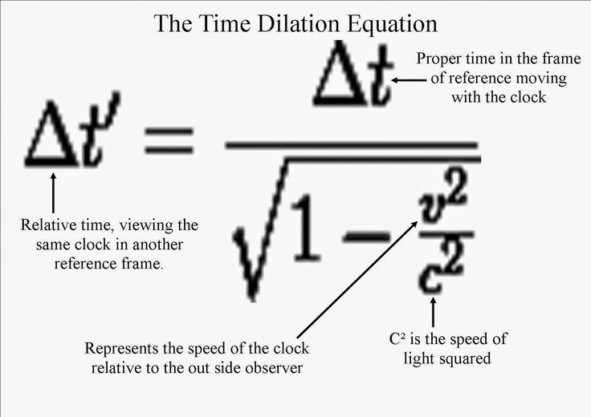

## Agenda

1. Introduction: Why time dilation ?
2. Example scenario
3. Using the Time Dilation Calculator


--- .class #id 

## 1. Introduction: Why time dilation ?

- According to theory of relativity, traveling at any speed (compared to a startionary observer) casues time to dilate from the perspective of the observer
- This time dilation effect exists at all speeds, but is undetectable at small speed
- As the traveling speed increases the time dilation effect becomes more noticeable 
- The following equation calculates the time dilation, relative to traveling speed:

<br/>

<br/>Source: https://www.pinterest.com/pin/69876231694436244

--- .class #id 

## 2. Example scenario

- The classic example: consider twin bothers -  
   - One twin (the stationary observer) remains on Earth, while the other twin (the traveler) boards a spacecraft that travels at a certain percentage of the speed of light. 
   - After traveling for a certain period of time at a certain speed, the traveler returns to Earth and reunites with the stationary observer twin
- Assuming the traveler travels at 80% of the speed of light, for a duration of 10 years, the resulting time dilation calculation and effect is as follows:

```r
speedOfLight <- 299792458 / 1000 # speed of light in vacuum (In Kilometers Per Second) 
percent <- 0.8; years <- 10
travelingSpeed <- percent * speedOfLight
timeDilationFactor <- (1 / sqrt(1 - (travelingSpeed^2 / speedOfLight^2) ))
durationFromStationaryObserverPerspective <- timeDilationFactor * years
sprintf("Elasped years from stationary observer perspective: %1$1.2f", durationFromStationaryObserverPerspective)
```

```
## [1] "Elasped years from stationary observer perspective: 16.67"
```

--- .class #id 

## 3. Using the Time Dilation Calculator

- The calculator requires two input parameters (visualized as sliders):
   1. Traveling speed (as a % of the speed of light in a vacuum)
   2. Duration of travel (in years, from the perspective of the traveler)
- The X axis of the graph illustrates the input of the speed as a percent of the speed of light 
   - (0 to 99.9, since 100% of the speed of light is not calculable)
- The Y axis of the graph displays the server-side calculated time dilation factor
   - (i.e. how much time dilates from the perspective of the stationary observer compared to the traveler)

<br/>
Link: [ShinyApps.io Time Dilation Calculator](http://dannycohen.shinyapps.io/Time_Dilation_Calculator)


